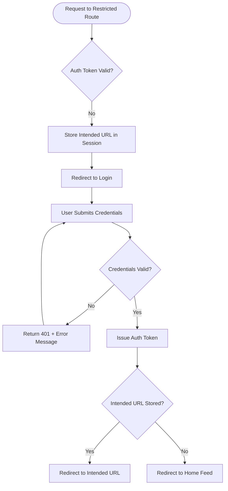
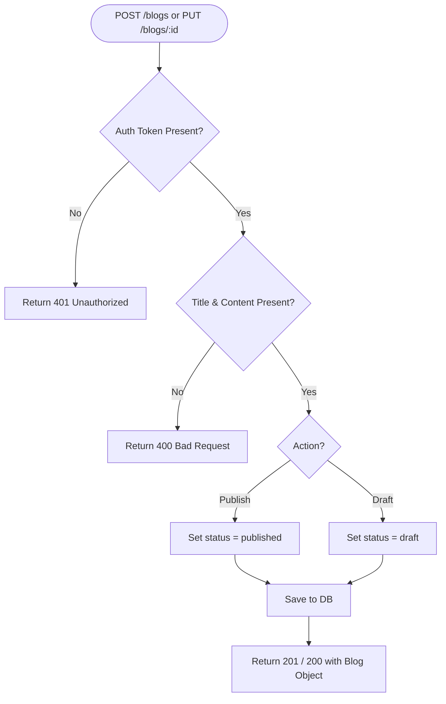
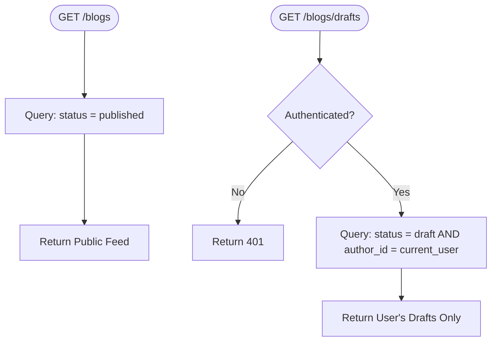
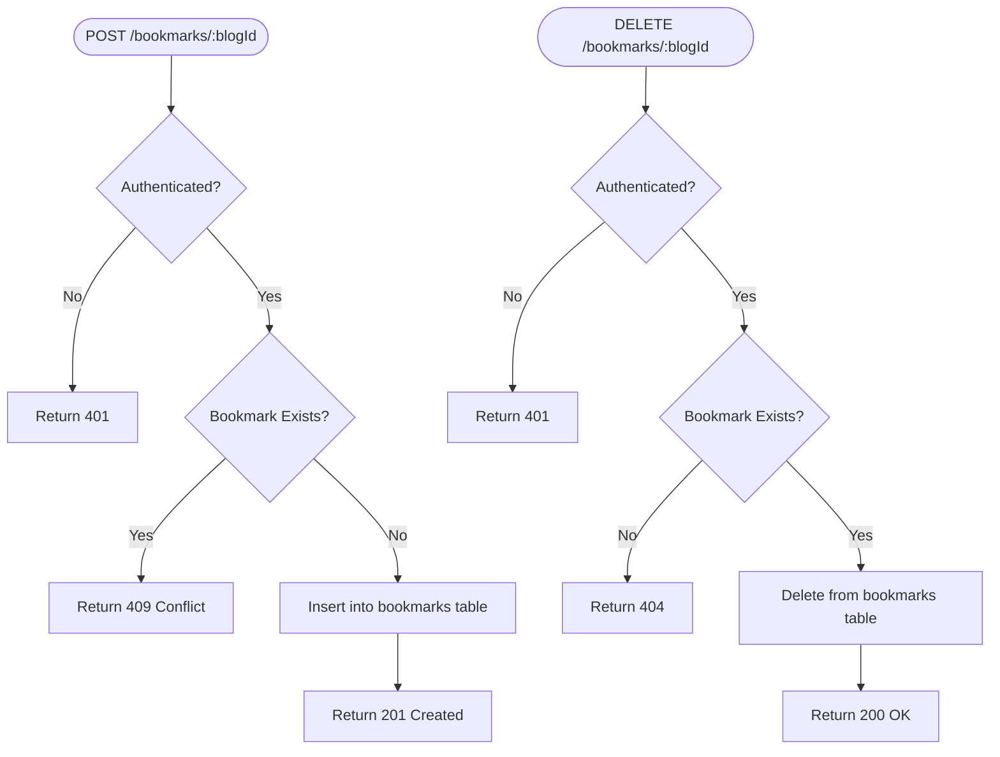
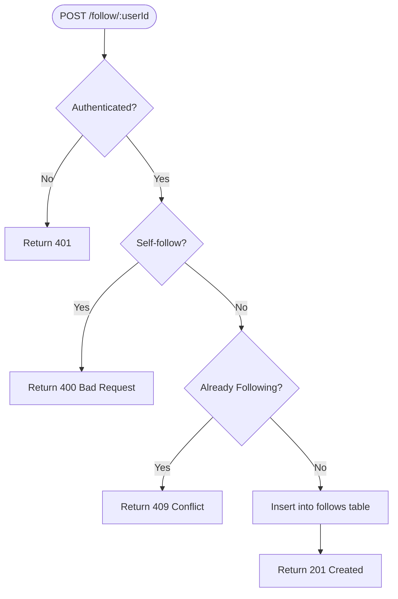
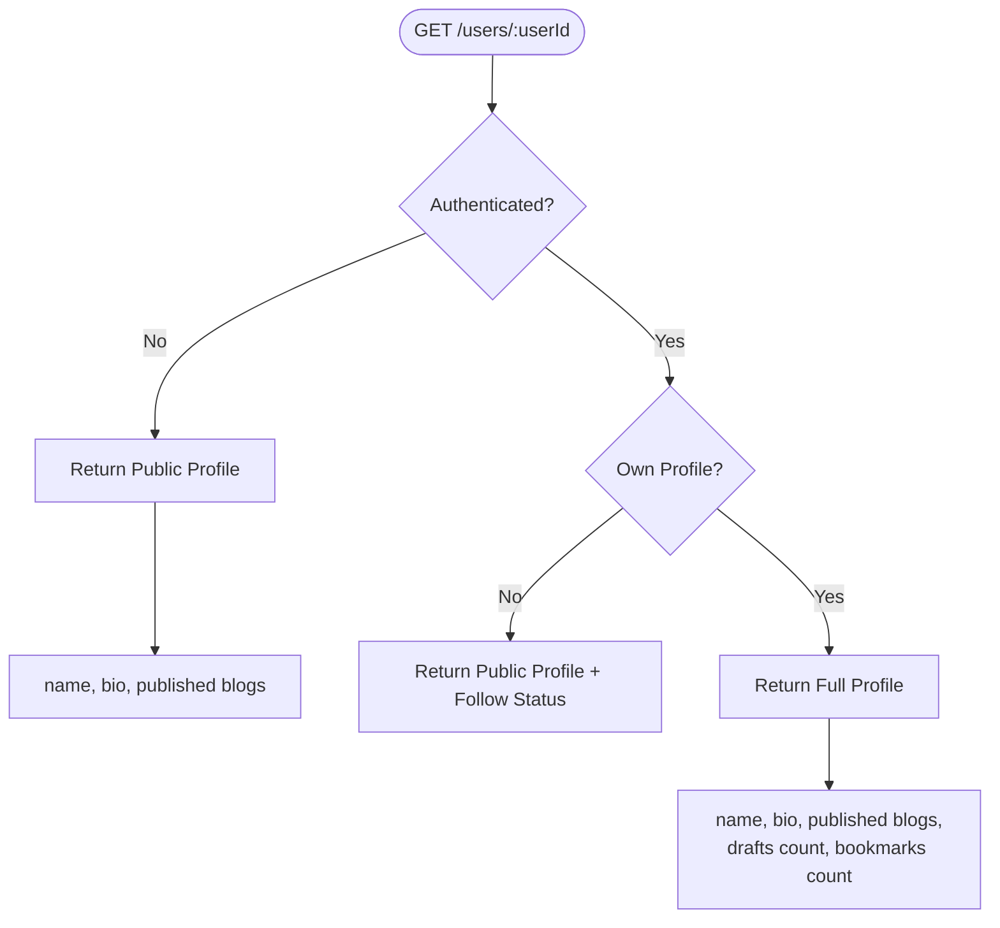
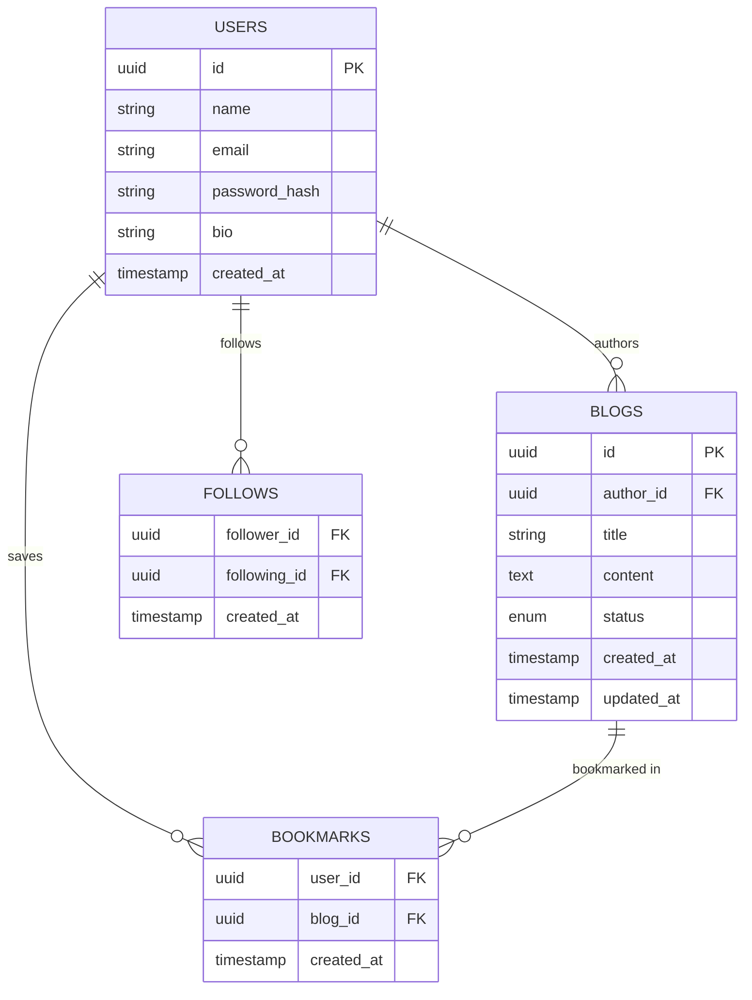

# Writespace – Technical Requirements (MVP)

---

## 🔐 Authentication & Authorization

### Requirements
- Implement session-based or token-based authentication (JWT recommended)
- Protect all restricted routes with auth middleware
- Store intended route before redirecting to login; restore after successful auth
- Differentiate guest and authenticated roles at the API level

### Auth Flow

---

## 📝 Blog CRUD

### Requirements
- `POST /blogs` — Create blog (auth required)
- `PUT /blogs/:id` — Update blog (author only)
- `DELETE /blogs/:id` — Delete blog (author only), soft delete preferred
- `GET /blogs` — List all published blogs (public)
- `GET /blogs/:id` — Get single blog (public)
- Enforce author ownership check on edit/delete at the API level
- Title and content fields are required; return `400` if missing

### Blog Write Flow

---

## 📋 Draft System

### Requirements
- Drafts stored with `status = draft` in the blogs table
- `GET /blogs/drafts` — Return only current user's drafts (auth required)
- Draft visibility enforced at query level — filter by `author_id = current_user`
- `PUT /blogs/:id/publish` — Transition draft to published
- Drafts must never appear in public blog feed

### Draft Visibility Rule

---

## 🔖 Bookmark System

### Requirements
- `POST /bookmarks/:blogId` — Add bookmark (auth required)
- `DELETE /bookmarks/:blogId` — Remove bookmark (auth required)
- `GET /bookmarks` — List current user's bookmarks (auth required)
- Bookmarks table: `user_id`, `blog_id`, `created_at`
- Unique constraint on `(user_id, blog_id)` to prevent duplicates
- Return `409` if bookmark already exists

### Bookmark Flow

---

## 👥 Follow System

### Requirements
- `POST /follow/:userId` — Follow a user (auth required)
- `DELETE /follow/:userId` — Unfollow a user (auth required)
- `GET /users/:userId/followers` — List followers (public)
- `GET /users/:userId/following` — List following (public)
- Follows table: `follower_id`, `following_id`, `created_at`
- Unique constraint on `(follower_id, following_id)`
- Prevent self-follow at API level; return `400`

### Follow Flow

---

## 👤 User Profile

### Requirements
- `GET /users/:userId` — Public profile (name, bio, published blogs)
- `PUT /users/me` — Update own profile (auth required)
- Profile response for own user includes: drafts count, bookmarks count
- Profile response for other users excludes: drafts, bookmarks
- Validate bio length and name on update; return `400` on failure

### Profile Access Control

---

## 🗄️ Data Model

---

## 🌐 API Summary

| Method | Endpoint | Auth | Description |
|---|---|:---:|---|
| `POST` | `/auth/login` | ❌ | Login and receive token |
| `POST` | `/auth/register` | ❌ | Register new user |
| `GET` | `/blogs` | ❌ | List all published blogs |
| `GET` | `/blogs/:id` | ❌ | Get single blog |
| `POST` | `/blogs` | ✅ | Create blog |
| `PUT` | `/blogs/:id` | ✅ | Update own blog |
| `DELETE` | `/blogs/:id` | ✅ | Delete own blog |
| `GET` | `/blogs/drafts` | ✅ | List own drafts |
| `PUT` | `/blogs/:id/publish` | ✅ | Publish a draft |
| `GET` | `/users/:id` | ❌ | View user profile |
| `PUT` | `/users/me` | ✅ | Edit own profile |
| `POST` | `/bookmarks/:blogId` | ✅ | Bookmark a blog |
| `DELETE` | `/bookmarks/:blogId` | ✅ | Remove bookmark |
| `GET` | `/bookmarks` | ✅ | List own bookmarks |
| `POST` | `/follow/:userId` | ✅ | Follow a user |
| `DELETE` | `/follow/:userId` | ✅ | Unfollow a user |
| `GET` | `/users/:id/followers` | ❌ | List followers |
| `GET` | `/users/:id/following` | ❌ | List following |

---

## ✅ Validation Rules

| Field | Rule |
|---|---|
| Blog title | Required, max 255 chars |
| Blog content | Required, non-empty |
| User name | Required, max 100 chars |
| User bio | Optional, max 500 chars |
| Email | Required, valid format, unique |
| Password | Required, min 8 chars |
| Follow self | Not allowed — return `400` |
| Duplicate bookmark | Not allowed — return `409` |
| Duplicate follow | Not allowed — return `409` |