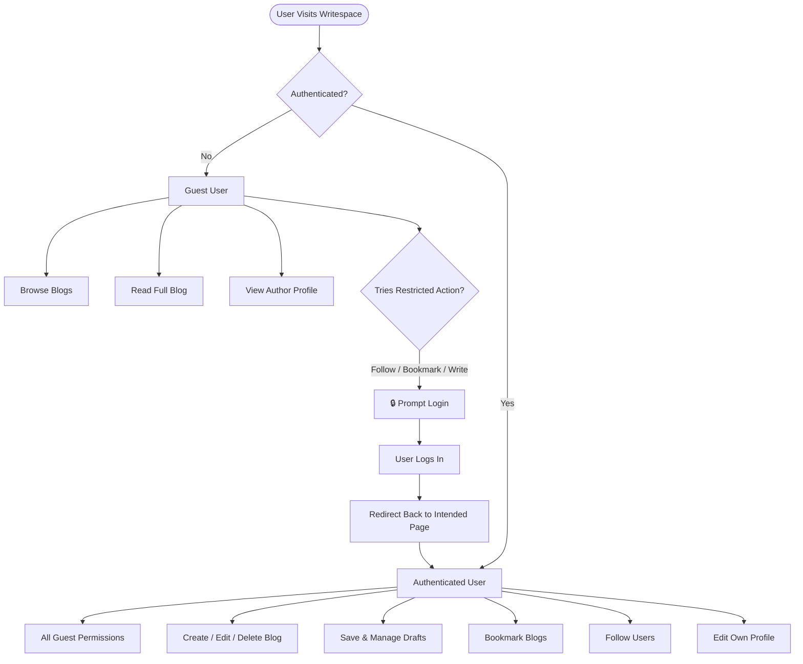
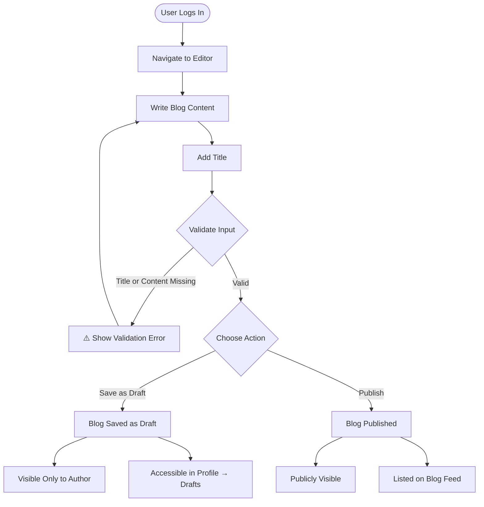
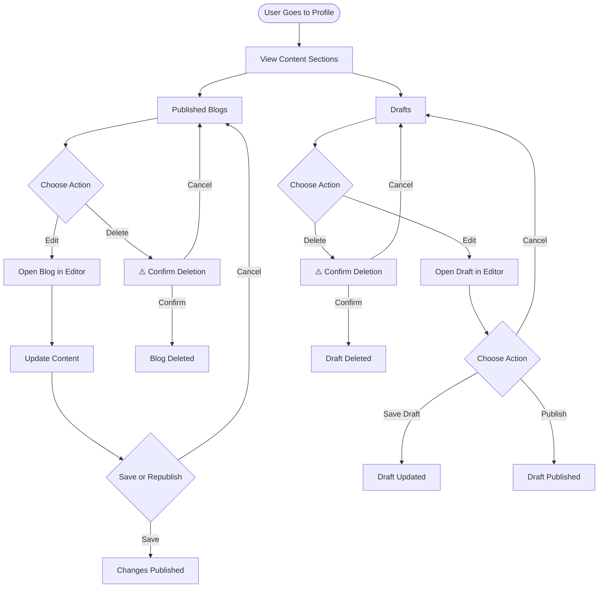
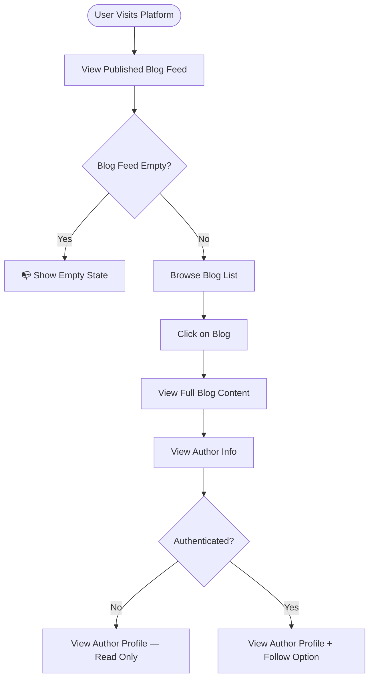
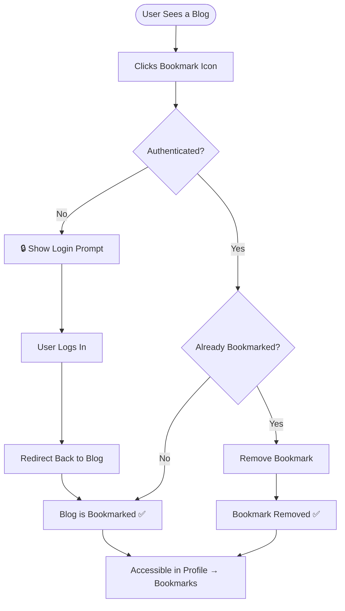
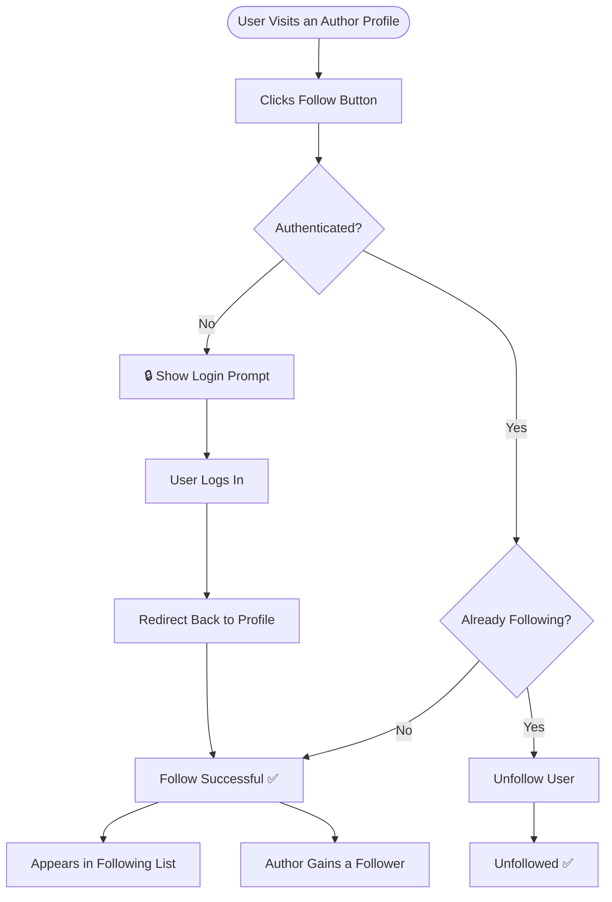
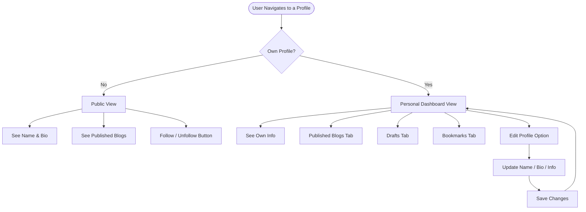
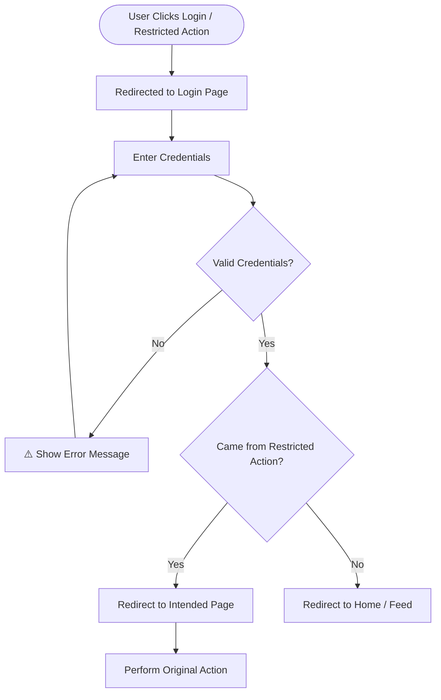
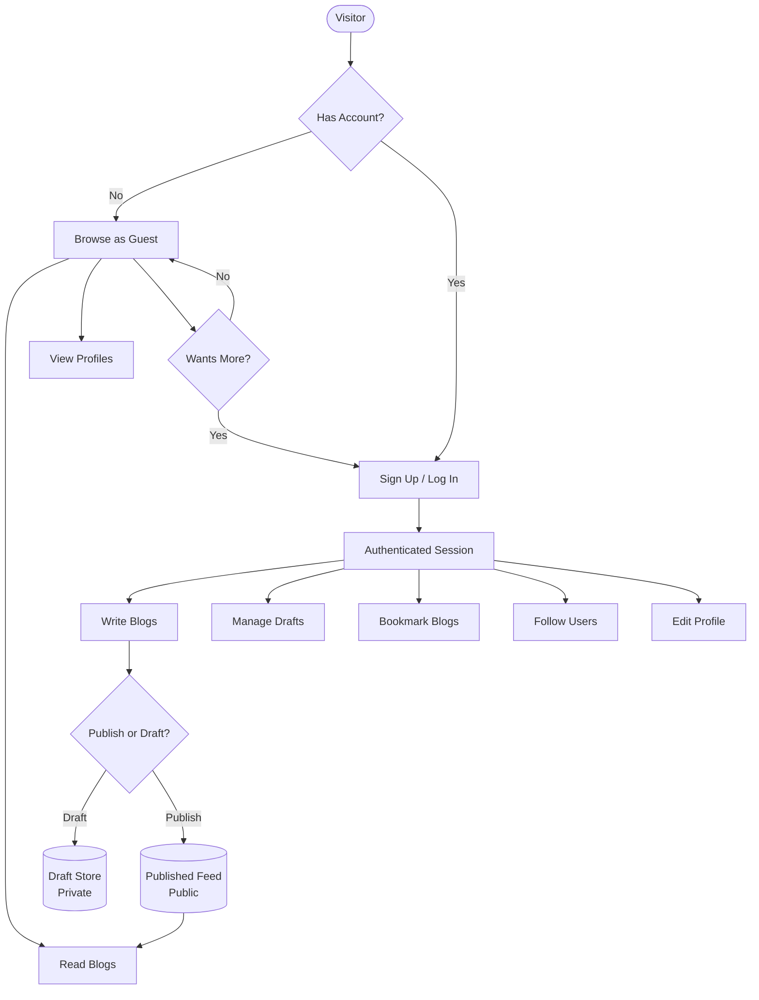

# Writespace – Workflow Documentation (MVP)

> Visual workflows for all core user flows, access control logic, and feature interactions.

---

## 🌍 Access Control Flow

---

## ✍️ Flow 1: Write & Publish Blog

---

## 📝 Flow 2: Manage Content

---

## 📖 Flow 3: Browse & Read Blog

---

## 🔖 Flow 4: Bookmark Blog

---

## 👥 Flow 5: Follow a User

---

## 👤 Flow 6: User Profile

---

## 🔐 Authentication Flow

---

## 🗺️ Overall System Flow

---

## 📊 Feature × Role Matrix

| Feature | Guest | Authenticated |
|---|:---:|:---:|
| Browse blog feed | ✅ | ✅ |
| Read full blog | ✅ | ✅ |
| View author profile | ✅ | ✅ |
| Create blog | ❌ | ✅ |
| Edit own blog | ❌ | ✅ |
| Delete own blog | ❌ | ✅ |
| Save as draft | ❌ | ✅ |
| View own drafts | ❌ | ✅ |
| Publish draft | ❌ | ✅ |
| Bookmark blog | ❌ | ✅ |
| View own bookmarks | ❌ | ✅ |
| Follow a user | ❌ | ✅ |
| Unfollow a user | ❌ | ✅ |
| Edit own profile | ❌ | ✅ |
